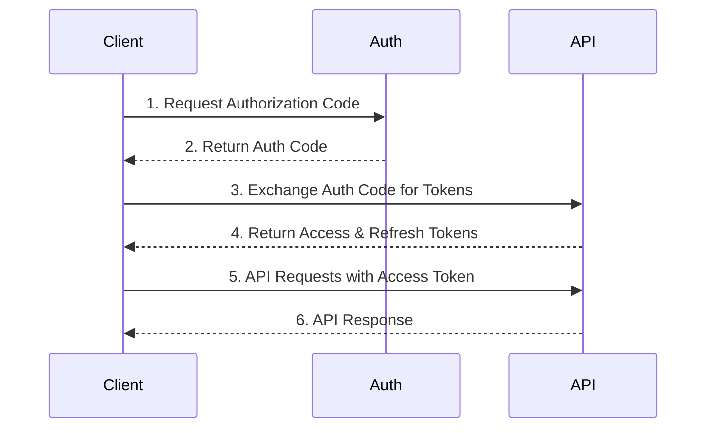
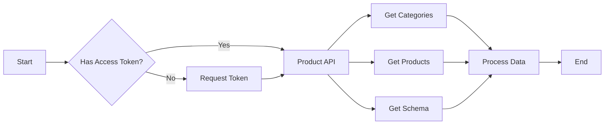

<h1 align="center"><a href="https://github.com/ronknight/alibaba-open-api">🌐 Alibaba Open API Integration</a></h1>
<h4 align="center">A Python-based integration for the Alibaba Open API, providing authentication, token management, and product listing functionalities.
</h4>
<p align="center">
<a href="https://twitter.com/PinoyITSolution"></a>
<a href="https://github.com/ronknight?tab=followers"></a>
<a href="https://github.com/ronknight/ronknight/stargazers"></a>
<a href="https://github.com/ronknight/ronknight/network/members"></a>
<a href="https://youtube.com/@PinoyITSolution"></a>
<a href="https://github.com/ronknight/alibaba-open-api/issues"></a>
<a href="https://github.com/ronknight/alibaba-open-api/blob/master/LICENSE"></a>
<a href="#"></a>
<a href="https://github.com/ronknight"></a>
</p>
<p align="center">
  <a href="#requirements">Requirements</a> •
  <a href="#usage">Usage</a> •
  <a href="#api-endpoints">API Endpoints</a> •
  <a href="#scripts">Scripts</a> •
  <a href="#disclaimer">Disclaimer</a> •
  <a href="#architecture">Architecture</a>
</p>

---

## 📋 Requirements

To run this project, you need:

- Python 3.7+
- pip (Python package installer)

Required Python packages:

```
anyio==4.4.0
argon2-cffi==23.1.0
requests==2.32.3
python-dotenv==1.0.1
```

A full list of dependencies can be found in the `requirements.txt` file.

## 🚀 Usage

1. Clone the repository:
   ```
   git clone https://github.com/ronknight/alibaba-open-api.git
   cd alibaba-open-api
   ```

2. Install the required packages:
   ```
   pip install -r requirements.txt
   ```

3. Set up your `.env` file with the necessary credentials:
   ```
   APP_KEY=your_app_key
   APP_SECRET=your_app_secret
   REDIRECT_URI=your_redirect_uri
   ```

4. Run the scripts in the following order:
   ```
   python 1initiate.py
   python 2createtoken.py
   python 3refreshtoken.py
   python productlist.py
   ```

## 📡 API Endpoints

### Authentication Endpoints
| Endpoint | Description |
|----------|-------------|
| `/auth/token/create` | Create new access and refresh tokens |
| `/auth/token/refresh` | Refresh existing access token |

### Product Endpoints
| Endpoint | Description |
|----------|-------------|
| `/icbu/product/list` | Get list of products |
| `/icbu/product/category/get` | Get product category details |
| `/icbu/product/schema/level/get` | Get product schema level |

### Category Endpoints
| Endpoint | Description |
|----------|-------------|
| `/alibaba/icbu/category/id/mapping` | Get category ID mapping |
| `/icbu/product/category/get` | Get category information |

## 📜 Scripts

1. `1initiate.py`: Initiates the OAuth process and obtains the authorization code.
2. `2createtoken.py`: Creates access and refresh tokens using the authorization code.
3. `3refreshtoken.py`: Refreshes the access token using the refresh token.
4. `productlist.py`: Retrieves the product list using the access token.
5. `product_category_get.py`: Gets product category information.
6. `product_schema_level_get.py`: Gets product schema level information.

## ⚠️ Disclaimer

This project is for educational purposes only. Ensure you comply with Alibaba's API usage terms and conditions.

## 📊 Architecture

### Authentication Flow


### Product Data Flow
