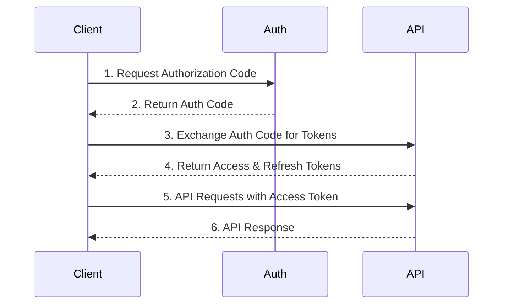
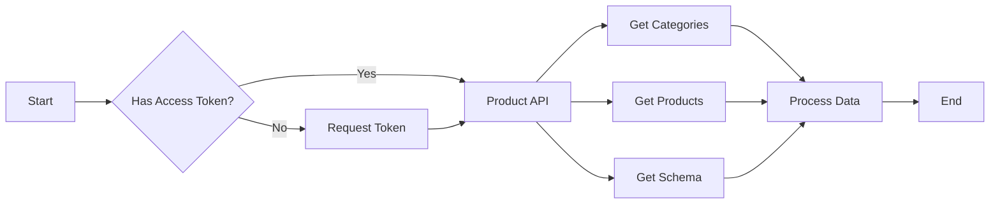

<h1 align="center"><a href="https://github.com/ronknight/alibaba-open-api">🌐 Alibaba Open API Integration</a></h1>
<h4 align="center">A Python-based integration for the Alibaba Open API, providing authentication, token management, and product listing functionalities.
</h4>
<p align="center">
<a href="https://twitter.com/PinoyITSolution"></a>
<a href="https://github.com/ronknight?tab=followers"></a>
<a href="https://github.com/ronknight/ronknight/stargazers"></a>
<a href="https://github.com/ronknight/ronknight/network/members"></a>
<a href="https://youtube.com/@PinoyITSolution"></a>
<a href="https://github.com/ronknight/alibaba-open-api/issues"></a>
<a href="https://github.com/ronknight/alibaba-open-api/blob/master/LICENSE"></a>
<a href="#"></a>
<a href="https://github.com/ronknight"></a>
</p>
<p align="center">
  <a href="#-requirements">📋 Requirements</a> •
  <a href="#-installation">⚡ Installation</a> •
  <a href="#-authentication-flow">🔐 Authentication</a> •
  <a href="#-api-endpoints">🔌 API Endpoints</a> •
  <a href="#-usage-examples">📝 Examples</a> •
  <a href="#-architecture">🏗️ Architecture</a>
</p>

---


## 📋 Requirements

To run this project, you need:

- Python 3.7+
- pip (Python package installer)

Required Python packages are listed in `requirements.txt`.

## ⚡ Installation

1. Clone the repository:
   ```bash
   git clone https://github.com/ronknight/alibaba-open-api.git
   cd alibaba-open-api
   ```

2. Install dependencies:
   ```bash
   pip install -r requirements.txt
   ```

3. Set up your `.env` file with:
   ```bash
   APP_KEY=your_app_key
   APP_SECRET=your_app_secret
   REDIRECT_URI=your_redirect_uri
   ```

## 🔐 Authentication Flow

1. **Initialize OAuth Process**:
   ```bash
   python 1initiate.py
   ```
   This will provide a URL to authorize your application.

2. **Create Access Token**:
   ```bash
   python 2createtoken.py
   ```
   Generates initial access and refresh tokens.

3. **Refresh Token**:
   ```bash
   python 3refreshtoken.py
   ```
   Use when access token expires.

## 🔌 Available Endpoints

### 🔑 Authentication Endpoints
| Script | Description | Usage |
|--------|-------------|--------|
| `1initiate.py` | Initiates OAuth flow | Required: `response_type`, `redirect_uri`, `client_id` |
| `2createtoken.py` | Creates access token | Required: `app_key`, `code`, `sign_method`, `timestamp` |
| `3refreshtoken.py` | Refreshes access token | Required: `app_key`, `refresh_token`, `sign_method`, `timestamp` |

### 📦 Product Endpoints
| Script | Description | Usage |
|--------|-------------|--------|
| `product_list.py` | List products with filters | All Optional:<br>`python product_list.py [--current_page N] [--page_size N] [--subject "text"] [--category_id N] [--gmt_modified_from "date"] [--gmt_modified_to "date"]` |
| `product_list_all.py` | List all products | All Optional:<br>`python product_list_all.py [--subject "text"] [--category_id N] [--gmt_modified_from "date"] [--gmt_modified_to "date"]` |
| `product_get.py` | Get single product details | Required: `--product_id`<br>`python product_get.py --product_id <id>` |
| `product_group_add.py` | Add product to a group | Required: `--product_id`, `--group_id`<br>`python product_group_add.py --product_id <id> --group_id <id>` |
| `product_id_encrypt.py` | Convert between original and encrypted product IDs | Required: `--product_id`, `--convert_type`<br>`python product_id_encrypt.py --product_id <id> --convert_type <1|2>`<br>1: original to encrypted, 2: encrypted to original |
| `product_inventory_get.py` | Get product inventory details | Required: `--product_id`<br>`python product_inventory_get.py --product_id <id>` |
| `product_inventory_update.py` | Update product inventory | Required: `--product_id`, `--sku_id`, `--quantity`<br>Optional: `--adjust`<br>`python product_inventory_update.py --product_id <id> --sku_id <id> --quantity <N> [--adjust]` |
| `product_batch_get.py` | Get multiple products | Required: `--csv`<br>`python tools/product_batch_get.py --csv <path>` |
| `product_update_display.py` | Update product display status | Required: `--product_id`, `--status`<br>`python product_update_display.py --product_id <id> --status <online\|offline>` |

### 📁 Category Endpoints
| Script | Description | Usage |
|--------|-------------|--------|
| `product_category_get.py` | Get category details | Required: `category_id`<br>`python product_category_get.py <category_id>` |
| `product_category_get_root.py` | Get root categories | No parameters required<br>`python product_category_get_root.py` |
| `product_category_id_mapping.py` | Map category IDs | Required: `--convert_type`<br>Optional: `--cat_id`, `--attribute_id`, `--attribute_value_id`<br>`python product_category_id_mapping.py --convert_type N [--cat_id N]` |

### 📋 Schema Endpoints
| Script | Description | Usage |
|--------|-------------|--------|
| `product_schema_get.py` | Get product schema | Required: `--cat_id`<br>Optional: `--schema_id`<br>`python product_schema_get.py --cat_id <id> [--schema_id <id>]` |
| `product_schema_level_get.py` | Get schema hierarchy | Required: `category_id`<br>`python product_schema_level_get.py <category_id>` |
| `product_schema_add.py` | Add a new product schema | Required: `--cat_id`<br>Optional: `--schema_data`<br>`python product_schema_add.py --cat_id <id> [--schema_data "json_data"]` |
| `product_schema_add_draft.py` | Create schema draft | Required: `--cat_id`<br>Optional: `--schema_data`<br>`python product_schema_add_draft.py --cat_id <id> [--schema_data "json_data"]` |
| `product_schema_update.py` | Update existing schema | Required: `--schema_id`<br>Optional: `--schema_data`<br>`python product_schema_update.py --schema_id <id> [--schema_data "json_data"]` |
| `product_schema_render.py` | Render product schema | Required: `--schema_id`<br>Optional: `--language`<br>`python product_schema_render.py --schema_id <id> [--language "en"]` |
| `product_schema_render_draft.py` | Render draft schema | Required: `--draft_id`<br>Optional: `--language`<br>`python product_schema_render_draft.py --draft_id <id> [--language "en"]` |

### 📊 Product Score Endpoints
| Script | Description | Usage |
|--------|-------------|--------|
| `product_score_get.py` | Get product quality score | Required: `--product_id`<br>`python product_score_get.py --product_id <id>` |

### 🖼️ Photo Bank Endpoints
| Script | Description | Usage |
|--------|-------------|--------|
| `product_photobank_group_list.py` | List photo bank groups | All Optional:<br>`python product_photobank_group_list.py [--current_page N] [--page_size N] [--gmt_create_start "YYYY-MM-DD HH:mm:ss"] [--gmt_create_end "date"] [--gmt_modified_start "date"] [--gmt_modified_end "date"]` |
| `product_photobank_group_operate.py` | Create/Update/Delete groups | Required: `--operation`<br>Required for create/update: `--group_name`<br>Required for update/delete: `--group_id`<br>Optional: `--description`<br>`python product_photobank_group_operate.py --operation <create\|update\|delete> [--group_name "name"] [--group_id "id"] [--description "desc"]` |
| `product_photobank_list.py` | List images in groups | Required: `--group_id`<br>Optional: `--current_page`, `--page_size`, `--gmt_create_start`, `--gmt_create_end`, `--gmt_modified_start`, `--gmt_modified_end`<br>`python product_photobank_list.py --group_id "id" [--current_page N] [--page_size N] [--gmt_create_start "YYYY-MM-DD HH:mm:ss"]` |
| `product_photobank_upload.py` | Upload image to group | Required: `--file_path`, `--group_id`<br>Optional: `--image_name`<br>`python product_photobank_upload.py --file_path "path/to/image.jpg" --group_id "id" [--image_name "name"]` |

## 📝 Usage Examples

### 📋 List Products with Filters
```bash
# Basic usage (all parameters optional)
python product_list.py

# With pagination parameters (optional)
python product_list.py --current_page 1 --page_size 20

# With search and filtering (optional)
python product_list.py --subject "T-shirt" --category_id 123456

# With date filtering (optional)
python product_list.py --gmt_modified_from "2024-01-01 00:00:00" --gmt_modified_to "2024-12-31 23:59:59"
```

### 🔍 Get Product Details
```bash
# Get single product (product_id required)
python product_get.py --product_id 123456789

# Batch get products (csv file required)
python tools/product_batch_get.py --csv "product_ids.csv"

# Update product display status (product_id and status required)
python product_update_display.py --product_id 123456789 --status online  # Put product on sale
python product_update_display.py --product_id 123456789 --status offline  # Take product off sale
```

### 📁 Work with Categories
```bash
# Get category details (category_id required)
python product_category_get.py 123456

# Get root categories (no parameters required)
python product_category_get_root.py

# Map category IDs (convert_type required)
python product_category_id_mapping.py --convert_type 1 --cat_id 123456  # cat_id optional
```

### 📋 Manage Product Schemas
```bash
# Get product schema (cat_id required)
python product_schema_get.py --cat_id 123456

# Get schema with specific ID (cat_id required, schema_id optional)
python product_schema_get.py --cat_id 123456 --schema_id 789

# Get schema hierarchy (category_id required)
python product_schema_level_get.py 123456
```

### 🖼️ Photo Bank Management
```bash
# List photo bank groups (all parameters optional)
python product_photobank_group_list.py
python product_photobank_group_list.py --current_page 2 --page_size 50
python product_photobank_group_list.py --gmt_create_start "2024-01-01 00:00:00" --gmt_create_end "2024-12-31 23:59:59"

# Create a new group (operation and group_name required)
python product_photobank_group_operate.py --operation create --group_name "My New Group" --description "Group description"

# Update an existing group (operation, group_id, and group_name required)
python product_photobank_group_operate.py --operation update --group_id "123456" --group_name "Updated Name" --description "New description"

# Delete a group (operation and group_id required)
python product_photobank_group_operate.py --operation delete --group_id "123456"

# List images in a group (group_id required, other parameters optional)
python product_photobank_list.py --group_id "123456"
python product_photobank_list.py --group_id "123456" --current_page 1 --page_size 50 --gmt_create_start "2024-01-01 00:00:00"

# Upload image to a group (file_path and group_id required)
python product_photobank_upload.py --file_path "images/product.jpg" --group_id "123456"

# Upload image with custom name
python product_photobank_upload.py --file_path "images/product.jpg" --group_id "123456" --image_name "custom_name.jpg"
```

## ⚠️ Error Handling

All scripts log detailed request and response information to the `api_logs` directory. Check these logs for troubleshooting.

## 🤝 Contributing

1. Fork the repository
2. Create a feature branch
3. Commit your changes
4. Push to the branch
5. Create a Pull Request

## 📄 License

This project is licensed under the MIT License - see the [LICENSE](LICENSE) file for details.

## 🏗️ Architecture

### 🔄 Authentication Flow


### 📊 Product Data Flow
